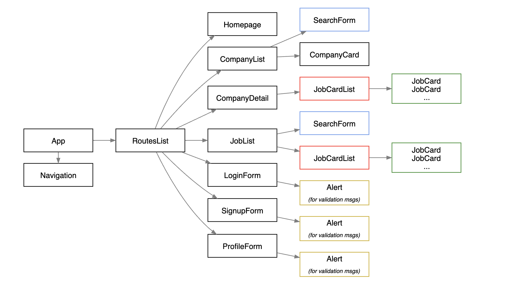

# Jobly Backend
Jobly is a full stack web application for job seekers. Users can create an account and log in to access a list of companies and jobs. Users can also search for a specific job or company using the search bar. The backend operates purely as an API, returning JSON data, and the frontend is built with React.

# Table of Contents
1. [What I learned](#What-I-learned)
2. [Features](#Features)
3. [Tech stack](#Tech-stack)
4. [Database Entity Relationships](#Database-entity-relationships)
5. [Install](#Install)
6. [Testing](#Testing)
7. [Deployment](#Deployment)
8. [Future features](#Future-features)

# What I learned
##### Frontend
* Organize API calls by making an API class.
* React context
* useEffect hook
* Design component hierarchies with props and state (see diagram below).

##### Backend
* Authentication/authorization with JWT Tokens
* Proper authorization checks are in place to ensure user is admin or logged-in user to complete additional activities (ex. creating, updating, and deleting profile)
* JSON schema
* TDD

## Features:
##### Frontend
* JoblyAPI class has helper methods for centralizing API calls, instead of having AJAX calls scattered all over components.
* Users can browse through library of companies and/or jobs with the option to filter using the search bar.
* Display different UI based on user authentication and authorization.

##### Backend
* Utilizes RESTful API.
* Authentication/authorization is with JWT tokens.
* Getting information on a user, updating, or deleting a user is only permitted by either an admin, or by that user.

## Tech stack:

### Backend:

### Frontend ([GitHub Repo](https://github.com/amathew195/react-jobly)):

### Database Management:

## Database Entity Relationships:

## Install:
To set up and load the database:

    createdb jobly < jobly.sql

This project uses Node.js for the back-end JavaScript runtime environment. To install the backend dependencies from the package.json file:

    npm install

To start the sever (port 3001):

    npm start

## Testing:
To run the tests:

    jest -i

Note: Any time you run our tests here, you will need to use the -i flag for Jest, so that the tests run “in band” (in order, not at the same time)

### Coverage Report:

## Deployment:
### Backend Deployment:
We used ElephantSQL and Render to deploy our backend.

In ElephantSQL, create a 'Tiny Turtle' instance and copy the URL of your new instance.

Seed your database:

    pg_dump -O jobly | psql (url you copied here)

In Render, create a new instance of “Web service”.

Connect to your repository and give your instance a name, which must be globally unique.

Choose advanced, and enter environmental variables:

    DATABASE_URL: URL from ElephantSQL

    SECRET_KEY: anything you want

Lastly select 'Create Web Service'

## Future features:
* "Apply" feature allows users to keep track of which jobs they have already applied for.
* User profile UI
* Dynamic live search
* Add additional search filters to search by number of employees, industry, position
* Have job application forms available for the user to submit
* Allow users to upload resume
* Allow status updates for job. For example, ‘interested’, ‘applied’, ‘accepted’, ‘rejected’

